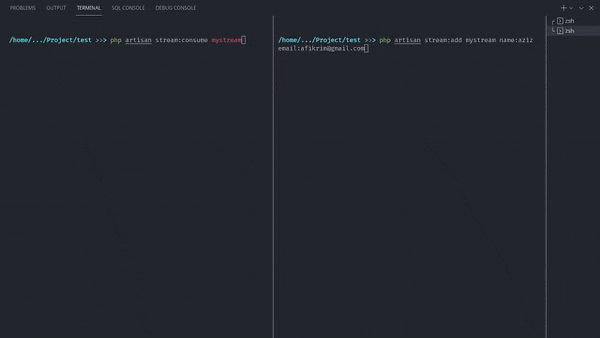

# Laravel Redis Stream

Use redis stream as your message broker in laravel.



### Installation

Install it by using,

```sh
composer require afikrim/laravel-redis-stream
```

After you install the package, register a new service provider in `bootstrap/app.php`

```php
// Register RedisServiceProvider to available facades for redis
$app->register(Illuminate\Redis\RedisServiceProvider::class);
// Register LaravelRedisServiceProvider to enable redis stream console commands
$app->register(\Afikrim\LaravelRedisStream\LaravelRedisStreamServiceProvider::class);
```

Then, you can add your custom consumer in `app/Console/Commands`

```php
<?php

namespace App\Console\Commands;

use Afikrim\LaravelRedisStream\Console\ConsumeCommand as BaseConsume;

class ConsumeCommand extends BaseConsume
{
	/**
	 * Function to handle incoming stream
	 *
	 * @param string $key    The stream key
	 * @param array $data    The incoming data
	 */
	protected function processData($key, array $data)
	{
		// Write your custom handler here.
	}
}
```

### How to send a data to the stream?

To send your data to the stream, you can use `Artisan::call` method to call `stream:add` command.

```php
...
	Artisan::call('stream:add', [
		$stream,
		...$fieldsAndValues // with format "field:value"
	])
...
```
